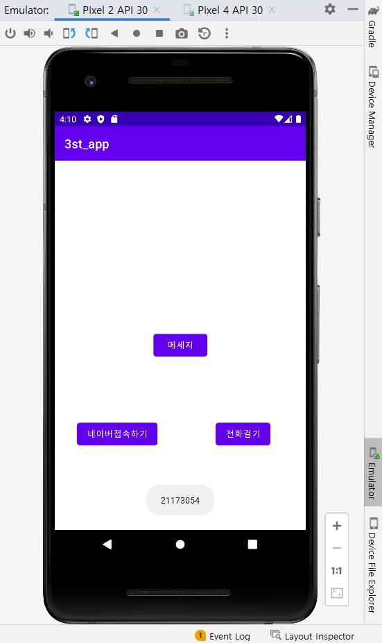
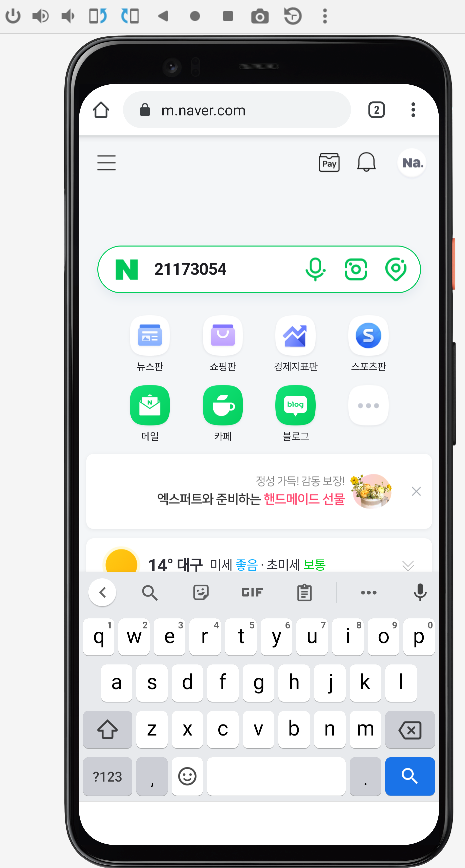
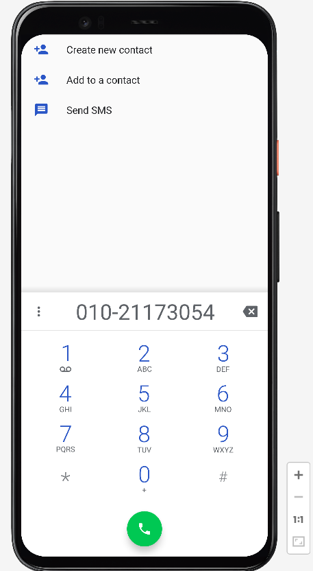
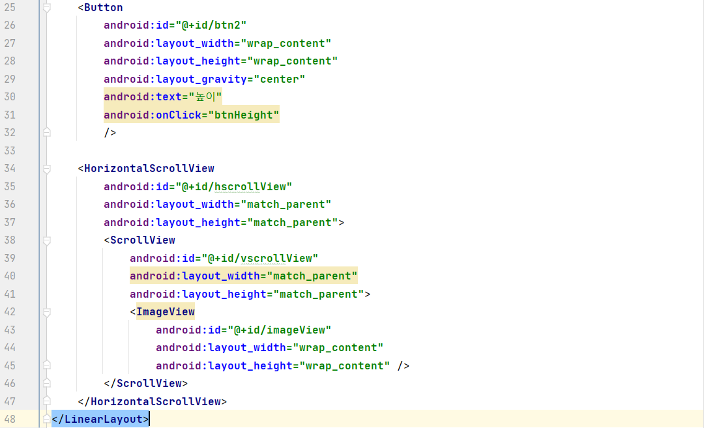
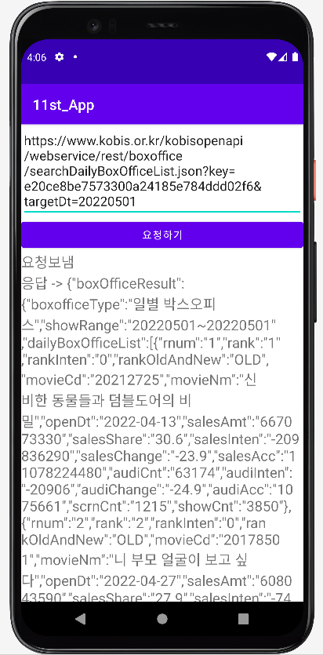

# 2주차 (2022-03-15)
- 안드로이드 스튜디오 설치 & 깃허브 가입 및 저장소 생성
\
</img>

# 3주차 (2022-03-22)
- 안드로이드 스튜디오 설치 & 깃허브 가입 및 저장소 생성
\
</img>
</img>
</img>

# 5주차 (2022-04-05)
- 이미지 바꾸기 버튼
\
</img>
</img>
</img>
</img>

# 6주차 (2022-04-12)
- 이미지 스크롤뷰 사용하기 & \
  (과제)두개의 버튼을 추가 삽입하여 \
한 개의 버튼을 클릭하면 \
    Toast.makeText() 이용 하단에 width 크기 값을 표시 (Interger.toString() 함수 사용) \
또 다른 버튼을 클릭하면 \
    Toast.makeText() 하단에 height 크기 값을 표시 (Interger.toString() 함수 사용)\
    하여 나타내기
\
</img>
</img>
</img>
</img>
</img>
</img>

# 9주차 과제 X (2022-05-03)
- SMS 입력화면을 만들고 글자 수 표시하기 (Byte) 
\
</img>
</img>
</img>
</img>
</img>
</img>

# 10주차 (2022-05-10)
- 여러 화면 만들고 화면 간 전환하기 
\
</img>
</img>
</img>

</img>
</img>
</img>
</img>

# 11주차 (2022-05-17)
- 웹으로 요청하기
\
</img>
</img>
</img>

</img>
